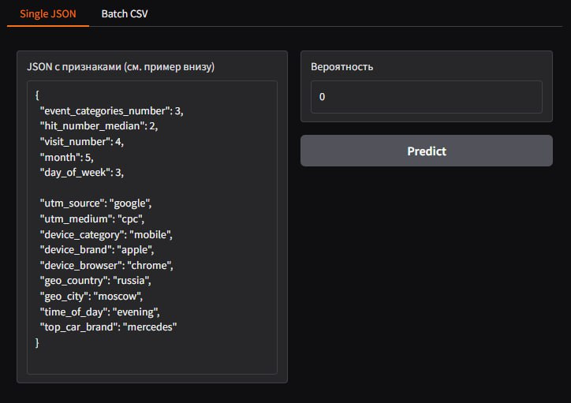
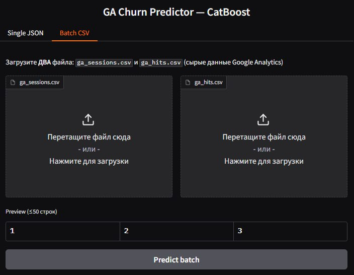
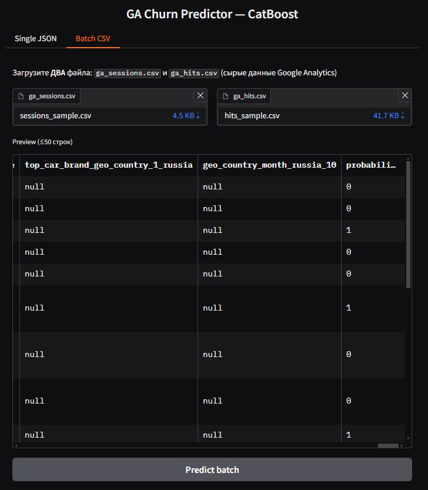

# Проект: Анализ сайта «СберАвтоподписка»
Учебный хакатон «СберАвтоподписка»

**Авторы:**
- Журавлев Александр ([drSever](https://github.com/drSever))
- Василий Феде ([FedeVas](https://github.com/FedeVas))
- Нина Кулюлина ([kulyulinanina](https://github.com/kulyulinanina))

[Презентация](presentation.pdf)

# О проекте
**СберАвтоподписка** — это сервис долгосрочной аренды автомобилей для физических лиц. Клиент платит фиксированную сумму в месяц и получает авто в пользование сроком от 6 месяцев до 3 лет.

В стоимость включены:
- Страхование (КАСКО, ОСАГО, ДСАГО);
- ТО и ремонт;
- Сезонная смена и хранение шин;
- Круглосуточная поддержка.

Дополнительно можно заказать консьерж-сервис — доставка автомобиля в сервис и обратно.
Сервис выступает альтернативой покупке авто или автокредиту — машину выгоднее арендовать, а средства инвестировать.

## 🎯 Цель проекта
Компания «СберАвтоподписка» хочет увеличить эффективность сайта: улучшить пользовательский опыт, повысить конверсию, сделать рекламные кампании более результативными. Для этого вам предстоит **создать модель**, которая предсказывает *вероятность того, что пользователь совершит целевое действие* (оставит заявку, закажет звонок и пр.) на сайте.

Эта модель поможет:
- Оценивать эффективность каналов привлечения трафика;
- Адаптировать рекламные кампании;
- Улучшать UX сайта за счет анализа поведения пользователей.

## Материалы
- Подробный [бриф](https://lms.skillfactory.ru/asset-v1:SkillFactory+MIFIML-2sem+2025+type@asset+block@бриф_Учебная_задача__Анализ_сайта_.docx)
- [Материалы и данные](https://cloud.mail.ru/public/PXoc/hDmWMRLe6) для работы

# Структура репозитория
- [models/](models)
    - каталог содержит обученные модели в разных форматах:
        - Logistic Regresion
        - CatBoost
        - Gradient Boosting
        - LightGBM
- [model_api](https://github.com/drSever/SberAvto/blob/master/model_api) 
    - 📦 **наш сервис**: FastAPI + Gradio UI, Dockerfile, README
- [01_Initial_analysis.ipynb](https://github.com/drSever/SberAvto/blob/master/01_Initial_analysis.ipynb) 
    - первичный анализ двух представленных датасетов, очистка данных, сборка итогового датасета
- [02_EDA.ipynb](https://github.com/drSever/SberAvto/blob/master/02_EDA.ipynb)
    - EDA итогового датасета, преобразование и создание новых признаков, формирование датасета для обучения
- [03_Train.ipynb](https://github.com/drSever/SberAvto/blob/master/03_Train.ipynb)
    - обучение моделей 
- [docker-compose.model.yml](https://github.com/drSever/SberAvto/blob/master/docker-compose.model.yml)
    - доп. compose-файл для запуска `model_api` 

# Результаты работы 
## Выполнен первичный анализ двух представленных датасетов:
### Выводы по представленному датасету `GA Sessions`:
- размерность данных (1860042, 18)
- отсутствуют полные дубликаты строк
- данные содержат большое количество пропусков:
    - 99.2% строк имеют пропуски
    - более 50% пропусков содержат признаки `utm_keyword`, `device_os`, `device_model`.
    - также большое количество пропусков в признаках `utm_campaign`и`utm_adcontent`
    - признак `utm_medium` не имея явных пропусков, содержит скрытые пропуски (значения *(none)* и *(not set)* )
    - признак `device_screen_resolution` не имея явных пропусков, содержит скрытые пропуски (значения *0x0* и *(not set)* )
    - также имеются неявные пропуски в признаках `device_brand`, `geo_city` 
- в признаке `device_brand` имеются неявные дубликаты, что связано с прописными и строчными буквами одного и того же значения. 
### Выводы по датасету `GA Hits`:
- размерность данных (15726470, 11)
- отсутствуют полные дубликаты строк
- данные содержат большое количество пропусков:
    - 100% строк имеют пропуски
    - более 50% пропусков содержат признаки `hit_time`, `event_value`.
    - почти 40% пропусков в признаке `hit_referer`и 20% в признаке `event_label`
- признак `hit_type` имеет только 1 значение
## Выполнены очистка данных и сборка итогового датасета:
- представленные наборы данных **`ga_sessions`** и **`ga_hits`** были проанализированы и очищены от пропусков:
    - удалены признаки `utm_keyword`, `device_os`, `device_model`, `hit_time`, `event_value` т.к. содержали более 50% пропущенных значений
    - также удалены признаки `utm_campaign`, `utm_adcontent`, `hit_referer`, `event_label`, т.к. заполнение их пропусков было принято нецелесообразным
    - явные пропуски в признаке `utm_source` были в большинстве своем заполнены
    - неявные пропуски в признаке `utm_medium` были в большинстве своем заполнены
    - неявные пропуски в признаке `device_screen_resolution` были удалены
    - неявные пропуски в признаке `device_brand` были обработаны
    - размер датасета **`ga_sessions`** уменьшился менее 1%, размер **`ga_hits`** не изменился
- неявные дубликаты в категориальных признаках, связанные с регистром симоволов были устранены
- были созданы новые признаки:
    - из признака `device_screen_resolution` были получены признаки `screen_area` и `aspect_ratio`, исходный признак удален
    - из признака `hit_page_path` был извлеен признак `car_brand`, исходный признак удален
- из признака `event_action` был выделен таргет, исходный признак удален
- датасет **`ga_hits`** был сгруппирован по признаку `session_id`, если в данную сессию было выполнено хотя бы одно целевое действие (таргет) - значение сгруппированного таргета принимается за *True*. Значения остальных признаков при группировке были агрегированы.
- из набора данных **`ga_sessions`** и сгруппированного **`ga_hits`** было составлен окончательный датасет для EDA и моделирования.
## Выполнен EDA:
- были подробно обработаны и проанализированы числовые и категориальные признаки, удалены признаки не влияющие на таргет
- обработаны выбросы (замена медианой признака)
- было обнаружено, что:
    - чем выше по счету визит на сайт, тем выше доля целевых действий на сайте, хотя в 75% случаях случаев это 1-й визит 
    - это же справедливо для порядкового номера событий - чем он выше, тем выше вероятность целевого действия
    - чем больше действий в различных категориях осуществляет пользователь, тем выше доля целевых действий
    - данные представлены за период с 19 мая 2021 года по 31 декабря 2021 года
    - чаще пользователи заходят на сайт в дневное время, реже ночью. Днем также больше совершается целевых действий.
    - наиболее частый тип привлечения пользователя - *baner*, однако доля целевых действий максимальна при *referral*
    - только в 17% наблюдений мы имеем информацию о том, страницы с какими марками авто проматривали пользователи. В ТОП-3 по количеству просмотров входят Skoda, Mercedes-Benz и Lada-Vaz. В ТОП-3 по доле целевых действий входят Lada-Vaz, Hyundai и Kia. 
    - чаще пользователи заходят на сайт с мобильных устройств и только в 20% случаев с десктопных, при этом доля целевых действий пользователей выше, если он заходит с десктопа.
    - чаще пользователи заходят с устройств Apple, при этом доля целевых действий среди них минимально, в отличие от пользователей Samsung и Huawei
    - чаще используются браузеры Chrome, Safari, YandexBrowser, доля целевых действий выше при использовани Firefox, Edge, YandexBrowser, Chrome.
    - выяснено, что площадь экрана устройства и его соотношение сторон не влияют на таргет
    - в подавляющем большинстве пользователи находятся на территории РФ, они же чаще совершают целевое действие, в отличие от иностранцев
    - большинство пользователей из Москвы и Санкт-Петербурга, однако они реже остальных совершают целевое действие
- на основе попарных значений категориальных признаков были созданы новые признаки, в которых доля целевых действий более 7% и объем данной выборки составляет более 10% от объема датасета
- итоговый проанализированный и обработанный датасет сохранен
## Проведено обучение моделей:
### Особенности задачи обучения:
- решается задача бинарной классификации 
- в нашем датасете подаляющее большинство признаков - категориальные 
- имеется выраженный дисбаланс классов (доля класса 1 менее 5%)  
### Работа с датасетом:
- анализ **качества модели** производился на **отложенной** тестовой выборке, модель во время обучения ее **не видела**
- из тренировочной выборки при необходимости извлекалась валидационная
### Выбор моделей:
- Logistic Regression 
    - простая линейная модель 
    - быстро обучается
- ансамблевые "деревянные" модели (CatBoost, Gradient Boosting, LightGBM) - они отличаются между собой по построению деревьев, оптимизации, скорости работы
    - CatBoost, LightGBM 
        - нативно поддерживают категориальные признаки (хотя нужна их определенная предобработка)
	    - хорошо работают на несбалансированных данных
### Выбор метрик:
- **НЕЛЬЗЯ** использовать **Accuracy** - модель предсказывающая только класс 0 получит ее значение = 0.95
- **ROC-AUC** (Area Under the ROC Curve) - устойчива к дисбалансу, показывает способность модели различать классы
- **PR-AUC** (Precision-Recall AUC) - более информативна при сильном дисбалансе (фокусируется на положительном классе)

### Результаты обучения:
- обучены и сохранены модели:
    - Logistic Regression
    - CatBoost
    - Gradient Boosting
    - LightGBM
- получены метрики на отложенной тестовой выборке (модели CatBoost и LightGBM):
    - ROC-AUC = 0.87
    - PR-AUC = 0.25
    - при доле целевого класса 1 = 4.74%

### Примечание:
- дополнительно были произведены эксперименты с обучением нейросети, однако ее метрики не превысили метрики моделей CatBoost и LightGBM
## API:
- 📦 API (CatBoost) обёрнут в Docker + UI;

## 🚀 Запуск модели через Docker

> Требуется **Docker ≥ 20.10**.  
> Читайте [Инструкцию](https://github.com/drSever/SberAvto/blob/master/model_api/README.md)

```bash
docker compose -f docker-compose.model.yml up -d

# Для остановки Ctrl + C
```
## Демонстрация работы



# Лицензия
Проект распространяется по лицензии MIT. Подробности в файле `LICENSE`.